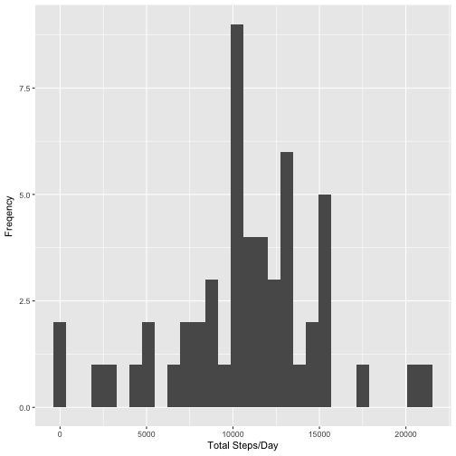
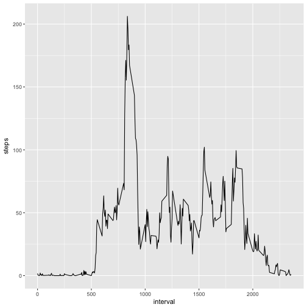
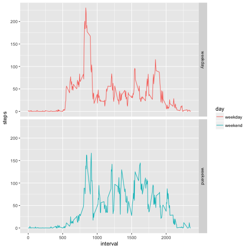

## Loading and preprocessing the data
Load the data  
Process/transform the data into a format suitable for your analysis.


```r
library(dplyr)
library(ggplot2)

url <- "https://d396qusza40orc.cloudfront.net/repdata%2Fdata%2Factivity.zip"
download.file(url, "fit.zip")
unzip("fit.zip")
unlink("fit.zip")
act <- read.csv("activity.csv")
act$date <- as.Date(act$date, "%Y-%m-%d")
```

## What is mean total number of steps taken per day?
For this part of the assignment, ignore the missing values in the dataset. 

Calculate the total number of steps taken per day.


```r
steps <- with(act, tapply(steps, date, sum))
```

Make a histogram of the total number of steps taken each day.


```r
qplot(steps, xlab="Total Steps/Day", ylab="Freqency")
```

```
## `stat_bin()` using `bins = 30`. Pick better value with `binwidth`.
```

```
## Warning: Removed 8 rows containing non-finite values (stat_bin).
```




Calculate and report the mean of the total number of steps taken per day. 

```r
steps_mean <- mean(steps, na.rm=T)
print("Mean Value")
```

```
## [1] "Mean Value"
```

```r
steps_mean
```

```
## [1] 10766.19
```

Calculate and report the median of the total number of steps taken per day.


```r
steps_median <- median(steps, na.rm=T)
print("Median Value")
```

```
## [1] "Median Value"
```

```r
steps_median
```

```
## [1] 10765
```

## What is the average daily activity pattern?
Make a time series plot of the 5-minute interval (x-axis) and the average number of steps taken, averaged across all days (y-axis).

```r
interval <- act %>%
        filter(!is.na(steps)) %>%
        group_by(interval) %>%
        summarize(steps = mean(steps))

ggplot(interval, aes(x = interval, y=steps)) + geom_line()
```



Which 5-minute interval, on average across all the days in the dataset, contains the maximum number of steps?

```r
interval[which.max(interval$steps), ]
```

```
## # A tibble: 1 × 2
##   interval    steps
##      <int>    <dbl>
## 1      835 206.1698
```

## Imputing missing values
Calculate and report the total number of missing values in the dataset.

```r
sum(is.na(act$steps))
```

```
## [1] 2304
```

Filling in all of the missing values in the dataset with the mean value of the steps in the same interval.


```r
na_marker <- is.na(act$steps)
act_new <- act
interval_mean <- with(act_new, tapply(steps, interval, mean, na.rm=T))
act_new$steps[na_marker] <- interval_mean[as.character(act_new$interval[na_marker])]
```

Make a histogram of the total number of steps taken each day and Calculate and report the mean and median total number of steps taken per day. 

```r
steps_new <- with(act_new, tapply(steps, date, sum))
qplot(steps, xlab="Total Steps/Day", ylab="Freqency")
```

```
## `stat_bin()` using `bins = 30`. Pick better value with `binwidth`.
```

```
## Warning: Removed 8 rows containing non-finite values (stat_bin).
```


Do these values differ from the estimates from the first part of the assignment? What is the impact of imputing missing data on the estimates of the total daily number of steps?

```r
steps_new_mean <- mean(steps_new)
steps_new_mean
```

```
## [1] 10766.19
```

```r
paste("New Mean Value - Origional Mean Value = ", steps_new_mean - steps_mean)
```

```
## [1] "New Mean Value - Origional Mean Value =  0"
```

```r
steps_new_median <- median(steps_new)
steps_new_median
```

```
## [1] 10766.19
```

```r
paste("New Median Value - Origional Median Value = ", steps_new_median - steps_median)
```

```
## [1] "New Median Value - Origional Median Value =  1.1886792452824"
```


## Are there differences in activity patterns between weekdays and weekends?
Create a new factor variable "day" in the dataset with two levels – "weekday" and "weekend" indicating whether a given date is a weekday or weekend day.


```r
act_new <- mutate(act_new, day = ifelse(as.character(weekdays(date)) %in% c("Saturday", "Sunday"), "weekend", "weekday"))
act_new$day <- as.factor(act_new$day)
```

Make a panel plot containing a time series plot of the 5-minute interval (x-axis) and the average number of steps taken, averaged across all weekday days or weekend days (y-axis).


```r
interval_new <- act_new %>% 
        group_by(interval, day) %>%
        summarize(steps = mean(steps))
ggplot(interval_new, aes(x = interval, y = steps, color = day)) + 
        geom_line() +
        facet_grid(day ~ .)
```




